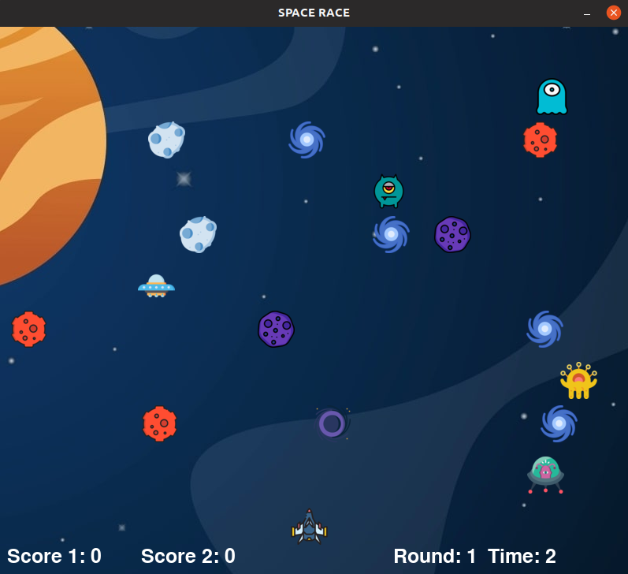

# SpaceRace
A silly game I made using pygame.

## Game Screenshot

## Requirements
- Python3 with standard libraries
- Pygame library

## How to run the game?
Clone this repository or download the files onto your linux machine. All the content should be inside a directory. Go to that directory and run 
~~~
python3 game.py
~~~
## Game Rules
- There are two players who can play against each other.
- There are 3 rounds, in which difficulty increases in each round.
- Player 1 moves using the ARROW keys. Player 2 moves using WASD keys.
- If a player is able to reach the opposite side within the first 10 seconds then he/she gets a time bonus.
- Player with maximum total score wins else it is a tie.

## Image/Music sources
- Images have been taken from flaticon.com
- Background Music has been taken from Free Vibes Youtube Channel.
- All of them are copyright-free and can be used freely.